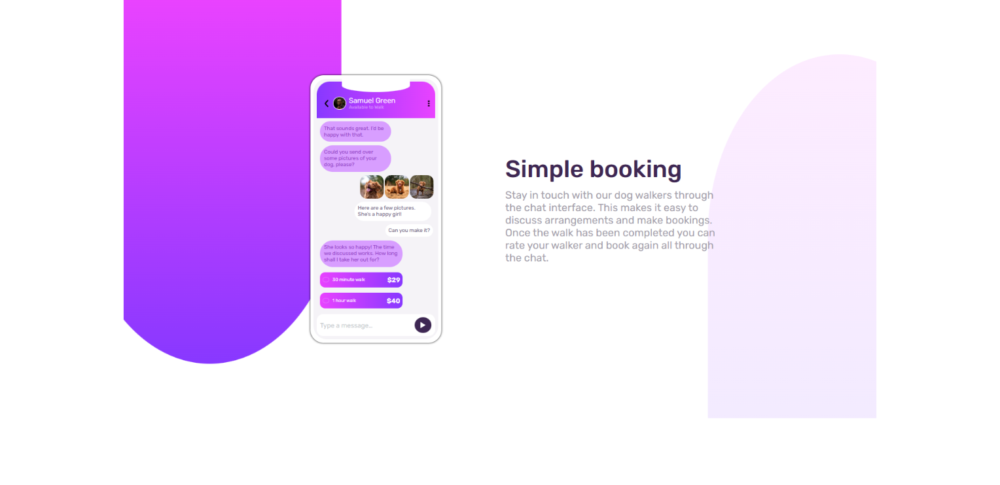

# Frontend Mentor - Chat app CSS illustration solution

This is a solution to the [Chat app CSS illustration challenge on Frontend Mentor](https://www.frontendmentor.io/challenges/chat-app-css-illustration-O5auMkFqY).

## Table of contents

- [Overview](#overview)
  - [The challenge](#the-challenge)
  - [Screenshot](#screenshot)
- [My process](#my-process)
  - [Built with](#built-with)
  - [What I learned](#what-i-learned)
  - [Continued development](#continued-development)

## Overview

### The challenge

Users should be able to:

- View the optimal layout for the component depending on their device's screen size
- **Bonus**: See the chat interface animate on the initial load

### Screenshot

## My process

### Built with

- HTML
- CSS
- CSS custom properties
- SASS/SCSS

### What I learned

This challenge offered extensive practice in positioning elements in CSS. My understanding for position properties in CSS improved a lot.

### Continued development

I still need to work on the following:

- Naming convention for CSS custom properties
- Using Semantic HTML
- Better Commenting
- Understanding overflow: hidden